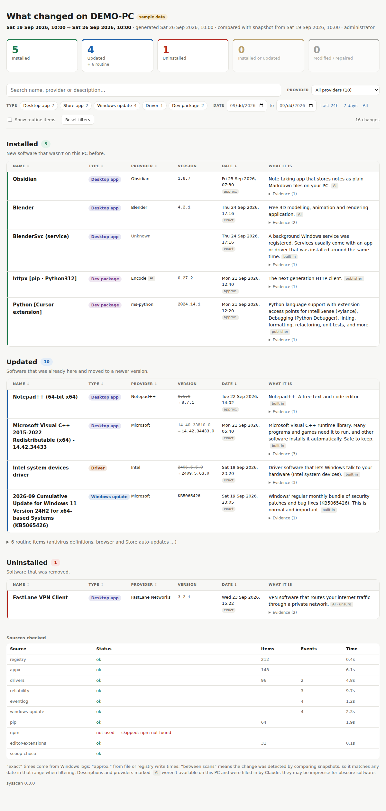
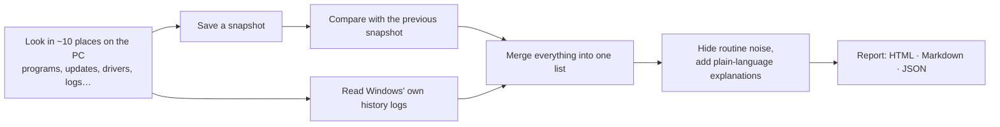

# sysscan: what changed on my PC?

[](https://github.com/YOUR_GITHUB_USERNAME/system-scanner/actions/workflows/ci.yml)


Something on your computer changed and you're not sure what? **sysscan** tells you what was
**installed**, **updated** or **removed** on your Windows PC, and explains in plain English what each
thing is.



<sub>A sample report made from made-up data (`sysscan demo`). There's also a [dark mode version](docs/sample-report-dark.png).</sub>

---

## Why this exists

Windows doesn't keep one simple list of "what changed". The answer is spread over a dozen places:
installed programs, Windows Update history, driver logs, Store apps, event logs and more. Some of
these forget things after a few weeks, and most of them only use technical names.

sysscan checks all of those places, takes a **snapshot** of your software every time it runs, and turns
the result into one easy-to-read report:

- **What changed:** installed, updated (with the old and new version), or removed.
- **When:** with an honest note on how exact the time is.
- **What it is:** a short plain-language explanation, such as *"Microsoft Visual C++ runtime library. Many
  programs and games need it to run…"*

## What you get

- 📋 **A report after every scan.** It's a web page (HTML) you open in your browser, plus Markdown and
  JSON copies.
- 🔎 **Filters.** Narrow the report by date, by who made the software, or by type (desktop app, Store app,
  Windows update, driver, developer package), or search for a name.
- 🧹 **Less noise.** Things that update constantly in the background, like antivirus definitions and
  browser updates, are tucked into a "routine" section.
- 🕰️ **Automatic daily snapshots.** Optional. They make the reports more complete over time.
- 🤖 **Optional AI explanations.** Claude (cloud) or local Ollama can explain software that sysscan
  doesn't recognise. With Claude, only basic facts about the software are sent; with Ollama, nothing leaves
  your PC.
- 🏷️ **Your own labels.** If you know what something is, tag it once and every future report uses your
  description.
- 🖱️ **`runScan`.** No Python needed: double-click it, type it in a terminal, or let it run silently at startup.

## Quick start

**Option A: no Python needed.** Download `runScan.exe` and `runScan.com` from the
[latest release](https://github.com/YOUR_GITHUB_USERNAME/system-scanner/releases) into one folder, then
either **double-click `runScan.exe`** or type **`runScan`** in a terminal (`runScan --help` lists
everything). Allow administrator rights when asked. When the scan finishes, the report opens in your
browser. `runScan --install-startup` makes it scan silently in the background every day.

**Option B: with Python 3.11 or newer.**

```powershell
pipx install "git+https://github.com/YOUR_GITHUB_USERNAME/system-scanner.git"
sysscan demo        # see what a report looks like (nothing is scanned)
sysscan             # scan your PC and open the report
```

> 💡 Run it as **administrator** (right-click PowerShell → *Run as administrator*) for the most complete
> results. It works without admin rights, but it can see less, and the report tells you so.

**➡️ Full instructions, every command and troubleshooting: [docs/USER_GUIDE.md](docs/USER_GUIDE.md)**

## Optional AI explanations

Off by default. When something isn't in the built-in rules and has no usable description on the PC,
sysscan can ask an AI. Pick one provider in a `.env` file (see [`.env.example`](.env.example)):

**Claude** (cloud — small API cost):

```ini
ANTHROPIC_API_KEY=sk-ant-...
SYSSCAN_AI=true
```

**Ollama** (local — free, nothing leaves your PC):

```ini
SYSSCAN_AI=true
SYSSCAN_AI_PROVIDER=ollama
SYSSCAN_AI_MODEL=llama3.2
```

```powershell
ollama pull llama3.2          # once; https://ollama.com/
sysscan collectors            # confirms the provider and that Ollama is reachable
sysscan scan --ai
```

Details, web search (Claude only), costs and privacy: [docs/USER_GUIDE.md §6](docs/USER_GUIDE.md#6-ai-explanations-optional).

## The five commands you'll use most

| Command | What it does |
|---|---|
| `sysscan` | Scans now and shows what changed since the last scan |
| `sysscan scan --since 7d` | Shows what changed in the last 7 days |
| `sysscan schedule install` | Takes a snapshot automatically every day (run once, as administrator) |
| `sysscan unknowns` | Lists anything the report couldn't identify |
| `sysscan tag "Name" --publisher "…" --description "…"` | Records what something is, so every future report knows it |

## What it can and can't tell you

sysscan tries to be honest about what Windows actually records.

| Question | First scan | Once it has taken a few snapshots |
|---|---|---|
| What was installed? | ✅ Mostly | ✅ Yes |
| What was updated, and from which version? | ⚠️ The new version, often not the old one | ✅ Yes |
| What was removed? | ⚠️ Only some programs | ✅ Yes, any program |
| Exactly when? | ⚠️ Exact when Windows logged it; otherwise approximate | ✅ Exact or "between two scans" |
| What changed *inside* an update? | ❌ Windows doesn't store that | ❌ |
| Portable apps (unzipped, never "installed") | ❌ Not tracked | ❌ |

**The more often it runs, the better the reports get.** That's what the daily snapshot is for.

## Privacy

- **Everything stays on your PC.** Snapshots and reports are saved in `%LOCALAPPDATA%\sysscan`.
- **AI is off unless you turn it on.** With **Claude**, sysscan sends Anthropic's API only facts about the
  software: its name, maker, version and type, plus clues such as the vendor's website or its folder
  under Program Files — and only for items it couldn't identify itself. With **Ollama**, the same facts
  stay on your machine. Answers are cached, so the same item isn't asked about again.
- **No personal details are sent.** Your user name, anything inside your user folder, and your computer's
  name and details are never included.

## How it works (short version)



Curious about the details and trade-offs? See [docs/DESIGN.md](docs/DESIGN.md).

## Where the information comes from

| Source | What it tells sysscan |
|---|---|
| Installed programs list (the registry) | Programs, versions, makers |
| Microsoft Store | Store apps and their updates |
| Device drivers + Windows' driver install log | Drivers and when they were installed |
| Reliability Monitor | Installs, removals and Windows updates, going back about a year |
| Event logs | Exact install/removal times, new background services |
| Windows Update history | Windows updates, driver updates, Defender updates |
| pip, npm, VS Code/Cursor, Scoop, Chocolatey | Developer tools that don't appear in "Installed apps" |

## Contributing

Contributions are welcome, especially new **plain-language descriptions** for common software. It's a
one-line change in [`src/sysscan/describe/rules.py`](src/sysscan/describe/rules.py). See
[CONTRIBUTING.md](CONTRIBUTING.md) for how to set up a development copy and run the tests.

## License

[MIT](LICENSE). Free to use, change and share.
